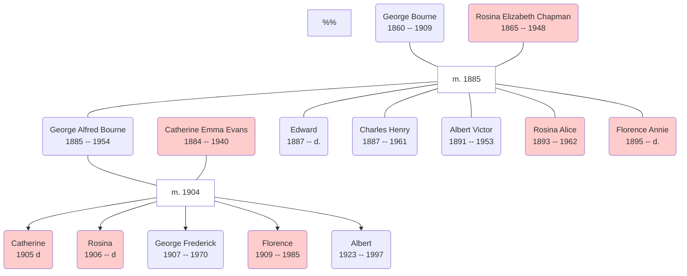

!!! info inline end ""
    
    A Bourne venture.

George Alfred Bourne was born in West Ham in 1885 and was one of the first to settle in the First Garden City of Letchworth after it was founded by Ebenezer Howard in 1903. One of the attractions of the Garden City movement was the separation of industry and residential areas of a town, with the attendant health and productivity benefits.

The family stories tell how George walked from the East End of London - Stratford, Essex more truthfully, perhaps - to the new town for opportunity, pushing a barrow of possessions before him. 

!!! info inline ""
    
    George Bourne, with pigs.

The Bourne family were entrepreneurial and soon established businesses including produce, grocery, transport and hospitality. George was responsible for a huge amount of the building which took place in Letchworth and his claim to fame was a very beautiful plastered ceiling in an iconic building in the town (the Spirella Building) for which  he was responsible.

## Marriage and family

George was the eldest of 6 children of George and Rosina (née Chapman) Bourne. Most of these stayed in London; his sister, also Rosina, emigrated to Canada. George married Catherine Evans in 1904. They had three daughters and two sons.

!!! info inline  ""
    
    George Bourne's daughters. Catherine, Florence and Rosina. 
    
In the family, I knew of the daughters as (Auntie) "Kit", "Florrie" and "Rose", but only remember Auntie Kit and Auntie Florrie. These two married (Jack Mason and Bert Downs, respectively) and settled in Letchworth.

Kit and Rose were born in Essex, but the eldest son, my grandfather George Frederick, was the first of the children born in Letchworth, in 1907, followed by Florence and, some time later, Albert.

### Catherine

!!! info inline ""
    
    Kate and Jack's wedding, Letchworth, December 1928.

Known variously as Kate or Kit, Catherine married Jack Mason. I remember their house in Monklands, and the tiled fireplace that was common in the small cottages at that end of the town owned by the Howard Cottage Society. Their fireplace had an ornament that was a painted plaster cast model of a steam train leaving a tunnel, which captured my imagination - I could see an entire world beyond the fireplace, where the train came from.

My grandfather is in the back row of the wedding photo with a cigarette. Everybody smoked in those days.

### Rosina

!!! info inline end ""
    
    Rose and Percy's wedding, Letchworth, I think, in 1926, before Kate and Jack. 
    
Rose was the third named thus in the family group, after her grandmother and aunt. She married Percy Radford and (I think) lived in Barkway. Their daughter Jean married Clifford Arnold and their daughter is my cousin Jacky Joiner (née Arnold).

My grandfather, again in the back row, looking a little younger. George Alfred Bourne is again standing behind the bride.

### G. F. Bourne

George Frederick Bourne was my grandfather. He married [Norah Brennan](2020-03-12-Norah-Brennan.md) and lived in Bedford Road, opposite to my old junior school. He loved to drive; his car of choice in his later life was a Triumph Herald. He was crippled by something like Parkinson's disease that eventually bound him to his bed on the ground floor of their home.

!!! info inline  ""
    
    Bert and Florrie's wedding in the local paper. It was Rosina's husband who gave her away.

He had a number of business interests including a partnership with the Whiteheads, the Espresso Bar café on Station Road, Letchworth, and previously a transport business in the war. He drove the supply line throughout the London *Blitzkrieg*, for which the reward was the forced nationalisation by a Labour government of the business. He wept when they drove his lorries away.

### Florence
Florrie married Bert Downs and lived on the corner of Archers Way and Haselfoot. I remember they kept corgis. Their daughter, Judith, married Derek Adams and they still live in Letchworth. The family had a long-standing relationship with the Spirella, the local factory that made everything from prams to parachutes, which is perhaps why their wedding warranted the strapline of, "Wedding of Spirella employee." My mother, Audrey Bourne, is mentioned in the clip as one of the bridesmaids.

### Albert

!!! info inline end ""
    
    Florrie, Kate and Albert Bourne in Letchworth around 1928

Albert was George Alfred's youngest son.

## Another Florence

!!! info inline  ""
    
    Florence King née Rodbard about 1940.

I was contacted by a cousin who sent me this photograph of her mother, Florence King, daughter of Florence Bourne, aged about 14. This would have been around 1940. You can see George Bourne's grocery van behind her in the photo. The Florence in the photograph's mother was Florence Annie Bourne, sister of George Alfred  and auntie to my grandfathe (see the tree image). Florence Annie married John Thomas Rodbard and their children would have been Rodbards -- Familysearch.org shows only John William Rodbard (b. 1915) but it's quite possible that Florence King in the photo was his sister.

!!! info inline  end ""
    
    Florence Annie Rodbard née Bourne
 
It's such a challenge in the Bourne family to work out who is who, because of their tradition of naming the first boy and girl after their parents. There are so many Georges and Rosinas in the Bourne family, it can be easy to get confused. Florence King (in the photo) was a refugee in the (second world) war, and stayed with Albert in Letchworth, when she got to know my mother, [Audrey](/family/People/2020-03-29-Audrey-Bourne/).

## Notes

Name|DoB|PoB|DoD|PoD
:---|:-:|:--|:-:|:--
George Alfred BOURNE|13 August 1885|West Ham, Essex|27 February 1954|Letchworth
Catherine Emma EVANS|May 1884|Middlesex|22 September 1940|Letchworth
Catherine BOURNE|1905|Stratford|
Rosina (F?) BOURNE|1906|Stratford|
George Frederick BOURNE|28 May 1907|Letchworth|Dec 1970|Letchworth
Florence Alice BOURNE|9 May 1909|Letchworh|16 August 1985|Letchworth
Albert Percy BOURNE|8 May 1923|Hitchin|March 1997|Hitchin