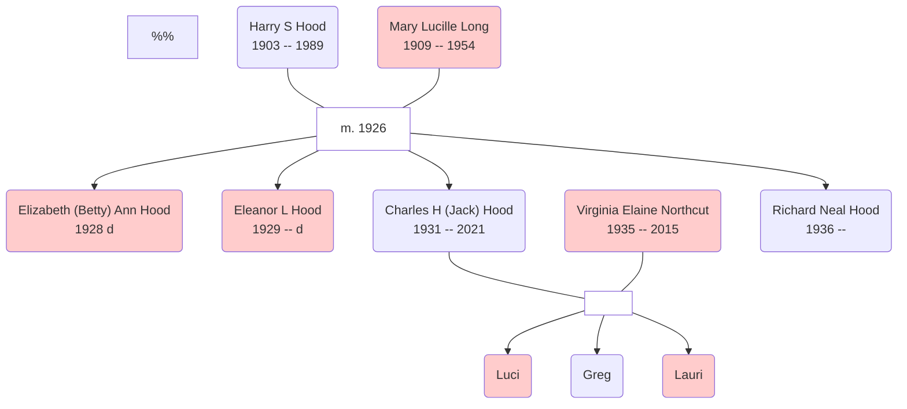

!!! info inline end ""
    
    "Uncle Jack"

From Jack's son-in-law, John Hauptmann, writing in January 2021.

> My buddy (and father-in-law) Charles “Jack” Hood passed over in his sleep this morning. Charlie’d been wrestling with dementia the past few years, and had slipped down hill pretty quickly the last couple of months. He was 89, and while he didn’t quite make it to 100 as he’d always threatened, he still had a hell of a good run.
>
> Charlie came out of the Great Depression & WWII, lost his mother early, flew Navy reconnaissance missions (backseat) during the Korean War, and faced (or “saw”, as he put it) a MIG on combat patrol. After Korea he put himself through college on the GI Bill, and spent his career with NASA & Boeing. He was a smart guy, and a for real rocket scientist.
>
> Charlie was dedicated to his children, and enjoyed golfing, fishing & tinkering with electronics. He was always up for a road trip, and we wandered our way across the better parts of the Pacific Northwest and the US & Canadian Rockies together.
>
> We hadn’t got to see much of Charlie recently due to Covid, but I did get to spend a couple of hours with him this past Sunday afternoon. I took over a stack of his shore leave photos from Fukuoka Japan, and we thumbed through them for old times sake. I think he enjoyed it, though he did ask a few times who all these “young fellers” were...
> 
> See you on the other side buddy.

John's words echo the respect that everyone in the family held for Jack. In the 1980's, I had a chance to meet up with him and his son, Greg, in Seattle when I was working at Boeing Field. We ate Mexican, the taste for which must be a genetic trait in the Hood DNA.

## Family tree

<!-- 
From Linda Webb 7 Jan 23: "Just so you know, Mom (Eleanor Hood) was born in 1929, not 1930. Grandma Hood did die in 1954. She died a day after my brother Mark was born in March of 1954." 
-->

Jack in relation to [Harry S Hood](../Hood/2020-04-03-Harry-S-Hood.md).

## Notes

Name|DoB|PoB|DoD|PoD|Comment
:---|:--|:--|:--|:--|:--
Charles (Jack) Hood|||6 Jan 2021|WA
Virginia Elaine Northcut|21 Nov 1935||22 April 2015||Wife
Harry Straight HOOD|8th April 1903|WV|15th April 1989|Hialeah, FL|Father
Mary Lucille LONG|31 July 1909|Mason Co., VA.|1954|?|Mother
