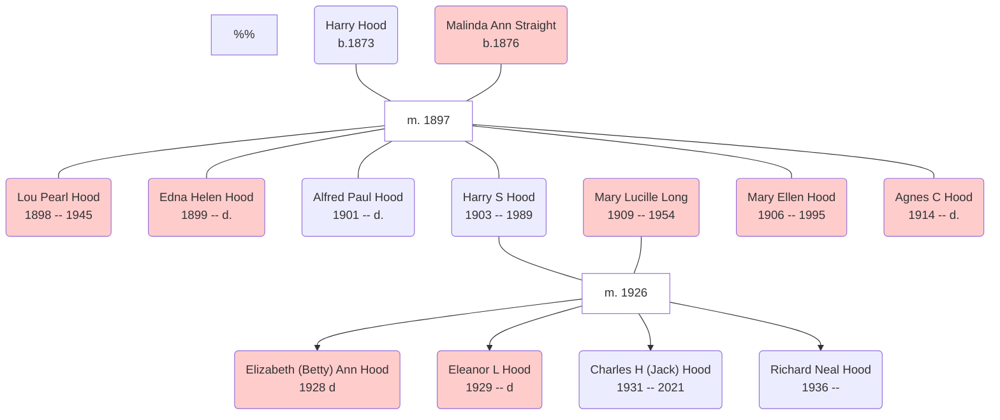

!!! info inline end ""
    
    Harry S. Hood, his son Charles, and two of Charles' daughters, Luci and Linda, in Miami, 1961.
    
Harry Straight Hood was born on 8th April 1903 in West Virginia. He was the last in the family to follow the tradition of bearing his mother's surname (Straight) as his middle name.

## Family
Harry Straight Hood was born on 8th April 1903 in West Virginia and died in Dade County, Florida, at the age of 86. He was married to Mary Lucille Long and had four children: Elizabeth (Betty-Ann), Eleanor, Charles (Jack), and Richard (Ric). 

The family lived in Harrison County, West Virginia, where the 1930 census record shows that Harry worked as a motor mechanic. A decade later, the county census has Lucille as the head of household and the four children living with her. His sister, Agnes Hood living with the family in 1930, is also absent from the 1940 census record for the household.

Harry's wife was killed in 1954 in a fire that broke out in a Pan-Am aircraft, according to the story I heard growing up, in a paint shop. She had escaped, but returned to rescue her friend who was still inside the fuselage. Harry married again later, to Irma. I met them both in Miami in the early 1980s, on a business trip to Tampa.

Harry was at one time a Dade County councilman - I was told once that there was at one time a Harry S. Hood building in Hialeah, standing in his honour. 

## Parents
Harry's parents were Harry Hood and Malinda Ann Straight.

## Family tree

Not shown in this family tree are Harry's second wife, Irma, and two of his younger siblings: an unnamed boy born in 1910, and Cora Malinda born and died in 1911.

## Notes

Name|DoB|PoB|DoD|PoD|Comment
:---|:--|:--|:--|:--|:--
Harry Straight HOOD|8th April 1903|WV|15th April 1989|Hialeah, FL
Mary Lucille LONG|31 July 1909|Mason Co., VA.|1954|?|Married 10 Aug 1926.
Harry HOOD|1873|WV|1949|?|Father
Malinda Ann STRAIGHT|1 Sep 1876|Marion Co., WV|21 July 1918|Monongalia Co., WV|Mother
